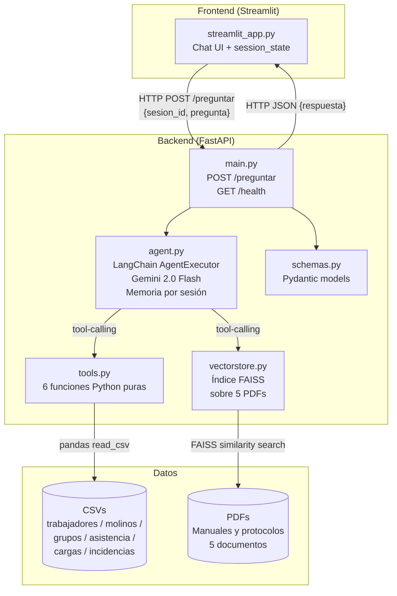
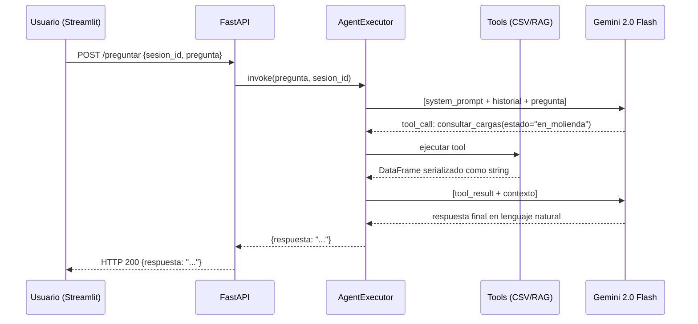
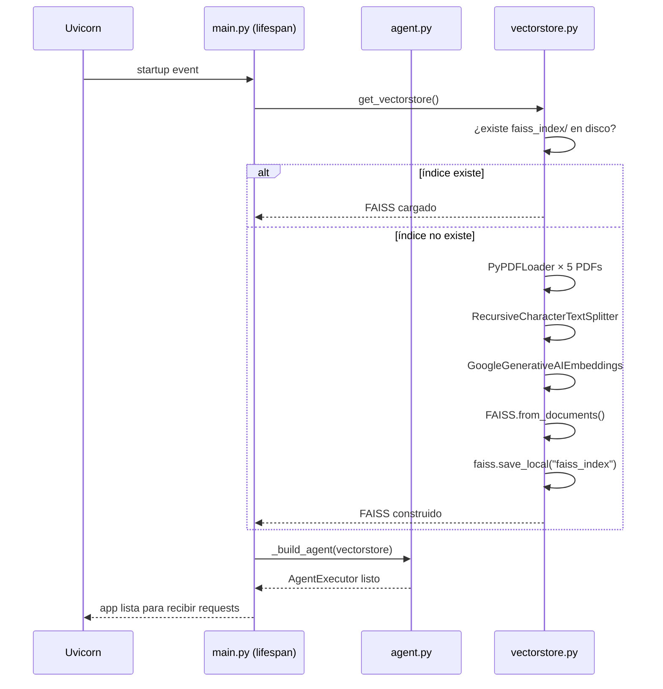

# Documento de Diseño: AlurAgente

## Visión General

AlurAgente es un agente conversacional de IA para la **Cooperativa Minera El Dorado**, diseñado para el Área de Acopio de Material Aurífero. Permite a supervisores, inspectores y administrativos consultar en lenguaje natural datos operativos (CSV) y documentación interna (PDF) sin necesidad de conocimientos técnicos.

El sistema sigue una arquitectura desacoplada: un frontend Streamlit intercambia mensajes JSON con un backend FastAPI, que orquesta un agente LangChain con tool-calling sobre Gemini 2.0 Flash. El frontend nunca importa código del agente directamente; toda interacción pasa por `POST /preguntar`.

El diseño prioriza **correctitud de respuestas** (el agente solo responde con base en tools, nunca inventa), **mantenibilidad** (cada capa es reemplazable de forma independiente) y **simplicidad de despliegue** (docker-compose para desarrollo local, Dockerfiles individuales para producción).

---

## Arquitectura de Alto Nivel



### Flujo de una consulta



---

## Componentes e Interfaces

### 1. `main.py` — FastAPI Entry Point

**Propósito**: Único punto de entrada HTTP. Valida requests, gestiona el ciclo de vida del agente y devuelve respuestas.

**Interfaz**:
```python
# POST /preguntar
class PreguntaRequest(BaseModel):
    sesion_id: str
    pregunta: str

class RespuestaResponse(BaseModel):
    respuesta: str

# GET /health
class HealthResponse(BaseModel):
    status: str  # siempre "ok"
```

**Responsabilidades**:
- Recibir y validar requests con Pydantic
- Llamar a `agent.get_respuesta(sesion_id, pregunta)`
- Capturar excepciones y devolver errores HTTP apropiados (500 con mensaje legible)
- Exponer `GET /health` para health-checks del orquestador

### 2. `agent.py` — Agente LangChain

**Propósito**: Orquesta el LLM con tool-calling y mantiene memoria conversacional por sesión.

**Interfaz**:
```python
def get_respuesta(sesion_id: str, pregunta: str) -> str:
    """
    Ejecuta el agente para la sesión dada.
    Crea la memoria de sesión si no existe.
    Devuelve la respuesta en lenguaje natural.
    """

def _build_agent() -> AgentExecutor:
    """
    Construye el AgentExecutor con tools y LLM.
    Se llama una sola vez al iniciar la app (startup event).
    """
```

**Responsabilidades**:
- Instanciar `ChatGoogleGenerativeAI` con `gemini-2.0-flash`
- Registrar las 6 tools usando `@tool` de LangChain
- Inyectar el `SYSTEM_PROMPT` con contexto de la Cooperativa
- Mantener un dict `{sesion_id: ConversationBufferWindowMemory}` en memoria
- Garantizar que el agente responda solo con base en resultados de tools

**System Prompt (sketch)**:
```
Eres AlurAgente, el asistente virtual del Área de Acopio de Material Aurífero
de la Cooperativa Minera El Dorado. Respondes ÚNICAMENTE con base en los
resultados que te devuelven las herramientas disponibles. Si la información
no está en los datos o documentos, dices claramente que no cuentas con esa
información. Nunca inventas datos, nombres, fechas ni cantidades.
```

### 3. `tools.py` — Las 6 Tools del Agente

**Propósito**: Funciones Python puras con acceso a CSV via Pandas y a FAISS via LangChain. Cada función es testeable sin LLM.

```python
@tool
def consultar_asistencia(
    id_trabajador: str = None,
    fecha_desde: str = None,   # formato YYYY-MM-DD
    fecha_hasta: str = None
) -> str:
    """
    Consulta el registro de asistencia del personal.
    Filtra por trabajador y/o rango de fechas.
    Devuelve asistencia, motivo de falta y cumplimiento de EPP.
    Usar cuando el usuario pregunta sobre asistencia, faltas o EPP de personal.
    """

@tool
def consultar_cargas(
    estado: str = None,        # almacenado | en_transporte | en_molienda | entregado
    molino_id: str = None,     # ej: "M-03"
    carga_id: str = None       # ej: "C-0045"
) -> str:
    """
    Consulta el estado y seguimiento de cargas de material aurífero.
    Devuelve carga_id, fecha, cantidad_kg, transportista, molino, estado y tiempos.
    Usar cuando el usuario pregunta sobre cargas, entregas o estado del material.
    """

@tool
def consultar_incidencias(
    tipo: str = None,          # trabajador | transportista | molino
    severidad: str = None,     # baja | media | alta
    estado: str = None,        # pendiente | resuelto | requiere_reevaluacion
    fecha_desde: str = None    # formato YYYY-MM-DD
) -> str:
    """
    Consulta incidencias registradas del área de acopio.
    Devuelve descripción, severidad, estado y entidad involucrada.
    Usar cuando el usuario pregunta sobre incidentes, problemas o infracciones.
    """

@tool
def consultar_molinos(
    estado: str = None,        # activo | requiere_reevaluacion
    molino_id: str = None      # ej: "M-10"
) -> str:
    """
    Consulta el estado y capacidad de los molinos/trapiches.
    Devuelve nombre, estado, motivo de estado y capacidad en ton/día.
    Usar cuando el usuario pregunta sobre molinos, trapiches o capacidad de molienda.
    """

@tool
def consultar_grupo_inspector(
    id_trabajador: str = None, # ej: "INS-005"
    grupo_id: str = None,      # ej: "G-03"
    periodo: str = None        # formato YYYY-MM, ej: "2026-07"
) -> str:
    """
    Consulta la asignación de grupos de inspectores por periodo y molino.
    Devuelve grupo, periodo, molino asignado, integrantes y líder.
    Usar cuando el usuario pregunta sobre grupos de inspección, rotación o asignación a molinos.
    """

@tool
def buscar_en_documentos(pregunta: str) -> str:
    """
    Busca información en los documentos internos (PDFs) de la Cooperativa.
    Incluye: Manual General, Protocolo de Seguridad y EPP, Reglamento de Rotación,
    Procedimiento de Recepción/Entrega y Política de Evaluación de Molinos.
    Usar cuando el usuario pregunta sobre procedimientos, normas, reglamentos o políticas.
    """
```

### 4. `vectorstore.py` — Índice FAISS

**Propósito**: Carga los 5 PDFs, los divide en chunks y construye/persiste el índice FAISS para búsqueda semántica.

**Interfaz**:
```python
def get_vectorstore() -> FAISS:
    """
    Devuelve el vectorstore FAISS.
    Si existe el índice en disco, lo carga.
    Si no existe, lo construye desde los PDFs y lo persiste.
    """

def _build_vectorstore(pdf_dir: Path) -> FAISS:
    """
    Carga PDFs con PyPDFLoader, divide con RecursiveCharacterTextSplitter
    (chunk_size=1000, overlap=200) y construye el índice FAISS
    con GoogleGenerativeAIEmbeddings.
    """
```

### 5. `schemas.py` — Modelos Pydantic

```python
class PreguntaRequest(BaseModel):
    sesion_id: str = Field(..., min_length=1, description="ID único de sesión")
    pregunta: str = Field(..., min_length=1, description="Pregunta en lenguaje natural")

class RespuestaResponse(BaseModel):
    respuesta: str

class HealthResponse(BaseModel):
    status: str = "ok"
```

### 6. `streamlit_app.py` — Frontend

**Propósito**: Chat UI que consume `BACKEND_URL/preguntar` via HTTP. Sin lógica de agente.

**Responsabilidades**:
- Mantener `st.session_state.messages` (historial visual)
- Mantener `st.session_state.sesion_id` (UUID generado al inicio)
- Hacer `requests.post(BACKEND_URL + "/preguntar", json={...})`
- Mostrar errores amigables si el backend no responde (timeout, ConnectionError)
- Leer `BACKEND_URL` desde variable de entorno (default `http://localhost:8000`)

---

## Modelos de Datos

### CSV: trabajadores.csv
| Campo | Tipo | Descripción |
|-------|------|-------------|
| id_trabajador | str | PK. Prefijo: SUP, INS, ACO, TRA |
| nombre | str | Nombre completo |
| rol | str | supervisor \| inspector \| acopiador \| transportista |
| cargo | str | Cargo descriptivo |
| grupo_asignado | str \| null | Solo para inspectores (G-01..G-10) |
| estado_laboral | str | activo \| cesado |
| fecha_ingreso | date | YYYY-MM-DD |

### CSV: molinos.csv
| Campo | Tipo | Descripción |
|-------|------|-------------|
| molino_id | str | PK. M-01..M-10 |
| nombre | str | Nombre del trapiche |
| estado | str | activo \| requiere_reevaluacion |
| motivo_estado | str \| null | Solo cuando no activo |
| capacidad_ton_dia | int | Capacidad diaria en toneladas |

### CSV: grupos_inspectores.csv
| Campo | Tipo | Descripción |
|-------|------|-------------|
| grupo_id | str | G-01..G-10 |
| periodo | str | YYYY-MM (mensual) |
| molino_asignado | str | FK → molinos.molino_id |
| integrantes | str | IDs separados por ";" |
| lider_grupo | str | FK → trabajadores.id_trabajador |

### CSV: asistencia.csv
| Campo | Tipo | Descripción |
|-------|------|-------------|
| fecha | date | YYYY-MM-DD |
| id_trabajador | str | FK → trabajadores |
| rol | str | rol en esa fecha |
| asistio | str | si \| no |
| motivo_falta | str \| null | Solo cuando no asistió |
| epp_completo | str | si \| no |

### CSV: cargas.csv
| Campo | Tipo | Descripción |
|-------|------|-------------|
| carga_id | str | C-0001..C-NNNN |
| fecha_recepcion | date | YYYY-MM-DD |
| cantidad_kg | float | Kilogramos de material |
| transportista_id | str | FK → trabajadores (TRA-*) |
| molino_asignado | str | FK → molinos |
| estado | str | almacenado \| en_transporte \| en_molienda \| entregado |
| tiempo_estimado_entrega | date | Fecha estimada |
| fecha_entrega_real | date \| null | Null si aún no entregado |

### CSV: incidencias.csv
| Campo | Tipo | Descripción |
|-------|------|-------------|
| incidencia_id | str | INC-001..INC-NNN |
| fecha | date | YYYY-MM-DD |
| tipo | str | trabajador \| transportista \| molino |
| entidad_id | str | FK → trabajadores o molinos |
| descripcion | str | Descripción del incidente |
| severidad | str | baja \| media \| alta |
| estado | str | pendiente \| resuelto \| requiere_reevaluacion |

---

## Diseño de Bajo Nivel

### Inicialización del Backend



### Algoritmo Principal: `get_respuesta`

```pascal
PROCEDURE get_respuesta(sesion_id, pregunta)
  INPUT: sesion_id: str, pregunta: str
  OUTPUT: respuesta: str

  SEQUENCE
    // Obtener o crear memoria de sesión
    IF sesion_id NOT IN session_memories THEN
      session_memories[sesion_id] ← ConversationBufferWindowMemory(k=10)
    END IF
    memoria ← session_memories[sesion_id]

    // Invocar agente con contexto de sesión
    resultado ← agent_executor.invoke({
      "input": pregunta,
      "chat_history": memoria.chat_memory.messages
    })

    // Guardar turno en memoria
    memoria.chat_memory.add_user_message(pregunta)
    memoria.chat_memory.add_ai_message(resultado["output"])

    RETURN resultado["output"]
  END SEQUENCE
END PROCEDURE
```

**Precondiciones:**
- `sesion_id` es un string no vacío
- `pregunta` es un string no vacío
- `agent_executor` ya fue construido en startup
- La variable de entorno `GOOGLE_API_KEY` está configurada

**Postcondiciones:**
- Retorna un string con la respuesta en lenguaje natural
- La memoria de sesión contiene el nuevo turno
- Si ocurre un error interno, propaga la excepción (la captura `main.py`)

**Loop Invariants:**
- `session_memories` nunca pierde sesiones existentes durante la ejecución

---

### Algoritmo: `consultar_cargas`

```pascal
PROCEDURE consultar_cargas(estado, molino_id, carga_id)
  INPUT: estado: str|None, molino_id: str|None, carga_id: str|None
  OUTPUT: resultado: str

  SEQUENCE
    df ← pd.read_csv(DATA_DIR / "cargas.csv")

    // Aplicar filtros acumulativos
    IF carga_id IS NOT NULL THEN
      df ← df[df.carga_id == carga_id]
    END IF

    IF estado IS NOT NULL THEN
      df ← df[df.estado == estado]
    END IF

    IF molino_id IS NOT NULL THEN
      df ← df[df.molino_asignado == molino_id]
    END IF

    IF df IS EMPTY THEN
      RETURN "No se encontraron cargas con los filtros indicados."
    END IF

    // Limitar resultados para evitar contextos muy largos
    IF len(df) > 20 THEN
      resumen ← f"Se encontraron {len(df)} cargas. Mostrando las 20 más recientes."
      df ← df.sort_values("fecha_recepcion", ascending=False).head(20)
    ELSE
      resumen ← f"Se encontraron {len(df)} carga(s)."
    END IF

    RETURN resumen + "\n" + df.to_string(index=False)
  END SEQUENCE
END PROCEDURE
```

**Precondiciones:**
- `cargas.csv` existe en `DATA_DIR`
- Al menos un parámetro puede ser None (consulta general)

**Postcondiciones:**
- Retorna string nunca vacío
- Si no hay resultados, retorna mensaje descriptivo (no excepción)
- Máximo 20 filas en la respuesta para controlar el tamaño del contexto

---

### Algoritmo: `consultar_asistencia`

```pascal
PROCEDURE consultar_asistencia(id_trabajador, fecha_desde, fecha_hasta)
  INPUT: id_trabajador: str|None, fecha_desde: str|None, fecha_hasta: str|None
  OUTPUT: resultado: str

  SEQUENCE
    df ← pd.read_csv(DATA_DIR / "asistencia.csv")
    df["fecha"] ← pd.to_datetime(df["fecha"])

    IF id_trabajador IS NOT NULL THEN
      df ← df[df.id_trabajador == id_trabajador]
    END IF

    IF fecha_desde IS NOT NULL THEN
      df ← df[df.fecha >= pd.to_datetime(fecha_desde)]
    END IF

    IF fecha_hasta IS NOT NULL THEN
      df ← df[df.fecha <= pd.to_datetime(fecha_hasta)]
    END IF

    IF df IS EMPTY THEN
      RETURN "No se encontraron registros de asistencia con los filtros indicados."
    END IF

    // Para consultas sin filtro de trabajador, mostrar resumen estadístico
    IF id_trabajador IS NULL AND len(df) > 50 THEN
      total ← len(df)
      presentes ← len(df[df.asistio == "si"])
      epp_ok ← len(df[df.epp_completo == "si"])
      RETURN f"Resumen: {total} registros. Asistencia: {presentes}/{total}. EPP completo: {epp_ok}/{total}.\n" +
             df.head(20).to_string(index=False)
    END IF

    RETURN f"{len(df)} registro(s) encontrado(s).\n" + df.to_string(index=False)
  END SEQUENCE
END PROCEDURE
```

---

### Algoritmo: `buscar_en_documentos`

```pascal
PROCEDURE buscar_en_documentos(pregunta)
  INPUT: pregunta: str
  OUTPUT: resultado: str

  SEQUENCE
    vectorstore ← get_vectorstore()  // singleton, ya cargado en startup

    // Búsqueda semántica: top-4 chunks más relevantes
    docs ← vectorstore.similarity_search(pregunta, k=4)

    IF docs IS EMPTY THEN
      RETURN "No se encontró información relevante en los documentos internos."
    END IF

    // Construir contexto concatenando chunks con su fuente
    contexto ← ""
    FOR doc IN docs DO
      fuente ← doc.metadata.get("source", "documento")
      contexto ← contexto + f"[{fuente}]\n{doc.page_content}\n\n"
    END FOR

    RETURN contexto.strip()
  END SEQUENCE
END PROCEDURE
```

**Precondiciones:**
- `vectorstore` es el singleton FAISS ya inicializado en startup
- `pregunta` es un string no vacío

**Postcondiciones:**
- Retorna fragmentos de texto de los documentos más relevantes
- Incluye la fuente (nombre del PDF) para trazabilidad

---

### Construcción del Agente: `_build_agent`

```pascal
PROCEDURE _build_agent(vectorstore)
  INPUT: vectorstore: FAISS
  OUTPUT: agent_executor: AgentExecutor

  SEQUENCE
    // Instanciar LLM
    llm ← ChatGoogleGenerativeAI(
      model="gemini-2.0-flash",
      temperature=0,
      google_api_key=GOOGLE_API_KEY
    )

    // Registrar tools
    tools ← [
      consultar_asistencia,
      consultar_cargas,
      consultar_incidencias,
      consultar_molinos,
      consultar_grupo_inspector,
      buscar_en_documentos  // closure con vectorstore inyectado
    ]

    // Construir prompt con system message
    prompt ← ChatPromptTemplate.from_messages([
      SystemMessage(content=SYSTEM_PROMPT),
      MessagesPlaceholder(variable_name="chat_history"),
      HumanMessagePromptTemplate.from_template("{input}"),
      MessagesPlaceholder(variable_name="agent_scratchpad")
    ])

    // Crear agente con tool-calling
    agent ← create_tool_calling_agent(llm, tools, prompt)

    agent_executor ← AgentExecutor(
      agent=agent,
      tools=tools,
      verbose=True,
      handle_parsing_errors=True,
      max_iterations=5
    )

    RETURN agent_executor
  END SEQUENCE
END PROCEDURE
```

**Precondiciones:**
- `GOOGLE_API_KEY` disponible como variable de entorno
- `vectorstore` es un objeto FAISS válido

**Postcondiciones:**
- Retorna un `AgentExecutor` con las 6 tools registradas
- `handle_parsing_errors=True` garantiza que errores de parsing no colapsen el servidor
- `max_iterations=5` previene loops infinitos en tool-calling

---

### Gestión de Memoria Conversacional

```pascal
// Estructura global en agent.py
session_memories: Dict[str, ConversationBufferWindowMemory] = {}

PROCEDURE _get_or_create_memory(sesion_id)
  INPUT: sesion_id: str
  OUTPUT: memory: ConversationBufferWindowMemory

  SEQUENCE
    IF sesion_id NOT IN session_memories THEN
      session_memories[sesion_id] ← ConversationBufferWindowMemory(
        k=10,                    // conserva últimos 10 intercambios
        return_messages=True,
        memory_key="chat_history"
      )
    END IF
    RETURN session_memories[sesion_id]
  END SEQUENCE
END PROCEDURE
```

**Nota de diseño**: La memoria se almacena en RAM del proceso FastAPI (dict en memoria). Para el alcance de este proyecto (demo), esto es suficiente. Para producción se reemplazaría por Redis o una base de datos, sin cambiar la interfaz de `get_respuesta`.

---

## Manejo de Errores

### Escenarios y Respuestas

| Escenario | Dónde se maneja | Respuesta al usuario |
|-----------|-----------------|---------------------|
| CSV no encontrado | `tools.py` (try/except) | "No se pudo acceder a los datos de [entidad]. Contacte al administrador." |
| PDF no encontrado al construir FAISS | `vectorstore.py` (warning + skip) | El índice se construye con los PDFs disponibles |
| Índice FAISS corrupto | `vectorstore.py` (except + rebuild) | Se reconstruye automáticamente |
| API Key inválida o agotada | `main.py` (HTTPException 503) | {"detail": "El servicio de IA no está disponible temporalmente."} |
| Error interno del agente | `main.py` (HTTPException 500) | {"detail": "Error al procesar la consulta."} |
| Backend no disponible (Streamlit) | `streamlit_app.py` (try/except requests) | "⚠️ No se pudo conectar con el servidor. Intente nuevamente." |
| Pregunta sin resultados en tools | `tools.py` (retorno string) | Mensaje descriptivo en lenguaje natural |

---

## Estrategia de Testing

### Pruebas Unitarias (tools.py)

Cada tool es una función pura testeable sin LLM. Se prueban:
- Filtros con resultados: `consultar_cargas(estado="en_molienda")`
- Filtros sin resultados: `consultar_cargas(carga_id="C-9999")`
- Sin filtros (resumen general): `consultar_molinos()`
- Valores inválidos (filtro que no matchea nada): retorna mensaje, no excepción

### `test_local.py` — Prueba End-to-End sin Frontend

```python
# Preguntas de ejemplo por rol:

# Supervisor de Área
preguntas_supervisor = [
    "¿Cuántos trabajadores faltaron esta semana?",
    "¿Qué incidencias están pendientes de resolver?",
    "¿Cuál es el estado actual de todos los molinos?",
]

# Inspector de Molienda
preguntas_inspector = [
    "¿A qué molino está asignado el grupo G-01 en julio 2026?",
    "¿Quiénes integran el grupo G-04 este mes?",
]

# Administrativo de Acopio
preguntas_administrativo = [
    "¿Cuántas cargas están actualmente en molienda?",
    "¿Cuál es el estado de la carga C-0051?",
    "¿Qué dice el procedimiento para la recepción de material?",
]
```

### Property-Based Testing (Propiedades de Correctitud)

Para la capa de tools, las siguientes propiedades deben cumplirse para cualquier entrada válida:

1. **Las tools nunca lanzan excepciones con entradas válidas**: para cualquier combinación de filtros válidos (incluyendo None), la tool retorna un string.

2. **Resultados acotados**: el resultado de cualquier tool tiene longitud menor a 10,000 caracteres (protege el contexto del LLM).

3. **Idempotencia**: llamar la misma tool con los mismos parámetros dos veces consecutivas retorna el mismo resultado (los CSVs no cambian en runtime).

4. **Sin resultados = mensaje descriptivo**: si los filtros no producen filas, el retorno es un string no vacío con un mensaje informativo.

---

## Consideraciones de Seguridad

- `GOOGLE_API_KEY` solo se lee desde variables de entorno, nunca hardcodeada
- Los CSVs son de solo lectura; ninguna tool escribe datos
- El frontend no tiene acceso directo al filesystem ni al agente
- No hay autenticación en esta versión (demo abierto según alcance del proyecto)
- Los inputs del usuario no se evalúan como código; Pandas filtra por valores, no ejecuta expresiones arbitrarias
- El `max_iterations=5` en el AgentExecutor previene prompt injection que induzca loops

---

## Consideraciones de Rendimiento

- El índice FAISS se persiste en disco (`faiss_index/`) y se carga una sola vez en startup (no se reconstruye en cada request)
- Los CSVs se leen en cada llamada a las tools (suficiente para el volumen actual: ~60 cargas, ~62 trabajadores, ~1200 registros de asistencia)
- Si el volumen crece significativamente, se puede agregar un caché LRU con `@lru_cache` sobre las funciones de lectura de CSV, sin cambiar la interfaz de las tools
- La memoria por sesión (`ConversationBufferWindowMemory(k=10)`) limita el historial enviado al LLM a los últimos 10 intercambios, controlando el costo de tokens

---

## Dependencias

### Backend (`backend/requirements.txt`)

| Paquete | Uso |
|---------|-----|
| `fastapi` | Framework HTTP |
| `uvicorn[standard]` | Servidor ASGI |
| `langchain` | Orquestación del agente y tools |
| `langchain-community` | FAISS loader, document loaders |
| `langchain-google-genai` | Integración con Gemini 2.0 Flash y embeddings |
| `faiss-cpu` | Índice vectorial para RAG |
| `pypdf` | Carga de documentos PDF |
| `pandas` | Consultas sobre CSVs |
| `python-dotenv` | Carga de variables de entorno desde `.env` |
| `pydantic` | Validación de schemas de API |

### Frontend (`frontend/requirements.txt`)

| Paquete | Uso |
|---------|-----|
| `streamlit` | UI conversacional |
| `requests` | HTTP client para llamar al backend |

---

## Estructura de Archivos Final

```
aluragente/
├── backend/
│   ├── app/
│   │   ├── __init__.py
│   │   ├── main.py          # FastAPI: POST /preguntar, GET /health
│   │   ├── agent.py         # AgentExecutor + memoria por sesión
│   │   ├── tools.py         # 6 tools Python puras
│   │   ├── vectorstore.py   # FAISS singleton sobre PDFs
│   │   └── schemas.py       # Pydantic: PreguntaRequest, RespuestaResponse
│   ├── data/
│   │   ├── trabajadores.csv
│   │   ├── molinos.csv
│   │   ├── grupos_inspectores.csv
│   │   ├── asistencia.csv
│   │   ├── cargas.csv
│   │   ├── incidencias.csv
│   │   └── documentos/
│   │       ├── Manual_General_Area_de_Acopio.pdf
│   │       ├── Protocolo_de_Seguridad_y_EPP.pdf
│   │       ├── Reglamento_de_Rotacion_de_Inspectores.pdf
│   │       ├── Procedimiento_Recepcion_y_Entrega_de_Material.pdf
│   │       └── Politica_de_Evaluacion_de_Molinos.pdf
│   ├── test_local.py
│   ├── requirements.txt
│   ├── Dockerfile
│   └── .env.example         # GOOGLE_API_KEY=
├── frontend/
│   ├── streamlit_app.py
│   ├── requirements.txt
│   ├── Dockerfile
│   └── .env.example         # BACKEND_URL=http://localhost:8000
├── docker-compose.yml
├── .gitignore
└── README.md
```

---

## Propiedades de Correctitud

*Una propiedad es una característica o comportamiento que debe ser verdadero en todas las ejecuciones válidas del sistema — esencialmente, una declaración formal sobre lo que el sistema debe hacer. Las propiedades sirven como puente entre las especificaciones legibles por humanos y las garantías de corrección verificables por máquina.*

### Propiedad 1: Validación de inputs del endpoint — no vacíos

*Para cualquier* combinación de valores de `sesion_id` y `pregunta` en la que al menos uno sea una cadena vacía o esté ausente, el Backend deberá rechazar la solicitud con HTTP 422 sin invocar al agente.

**Valida: Requisito 1.3**

---

### Propiedad 2: Respuesta siempre contiene el campo `respuesta`

*Para cualquier* solicitud válida a `POST /preguntar` (sesion_id y pregunta no vacíos), la respuesta HTTP 200 deberá contener un objeto JSON con el campo `respuesta` de tipo string.

**Valida: Requisito 1.4**

---

### Propiedad 3: Creación y recuperación de memoria por sesión

*Para cualquier* string `sesion_id` no vacío, invocar `_get_or_create_memory` dos veces con el mismo valor deberá retornar el mismo objeto Memoria_Sesion, garantizando que el historial se preserva entre llamadas.

**Valida: Requisitos 3.1, 3.2**

---

### Propiedad 4: Límite de memoria conversacional (k=10)

*Para cualquier* sesión en la que se hayan producido más de 10 intercambios, la Memoria_Sesion deberá contener como máximo 10 pares (pregunta, respuesta), descartando los más antiguos.

**Valida: Requisito 3.3**

---

### Propiedad 5: Las tools nunca lanzan excepciones con entradas válidas

*Para cualquier* combinación válida de parámetros de entrada de cualquiera de las 6 tools (incluyendo el caso en que todos los parámetros opcionales sean `None`), la invocación de la tool deberá retornar un string sin lanzar una excepción.

**Valida: Requisitos 4.6, 5.6, 6.5, 7.5, 8.5, 11.1**

---

### Propiedad 6: Resultado vacío = mensaje descriptivo (sin excepción)

*Para cualquier* combinación de filtros de cualquier tool que no produzca filas en el dataset correspondiente, el valor de retorno deberá ser un string no vacío con un mensaje informativo en lenguaje natural — nunca una excepción propagada ni un string vacío.

**Valida: Requisitos 4.5, 5.4, 6.3, 7.3, 8.4, 11.4**

---

### Propiedad 7: Idempotencia de las tools

*Para cualquier* tool y cualquier combinación válida de parámetros, invocarla dos veces consecutivas con los mismos argumentos deberá producir el mismo resultado, dado que los archivos CSV son de solo lectura durante el tiempo de vida del proceso.

**Valida: Requisito 11.2**

---

### Propiedad 8: Resultados acotados (< 10 000 caracteres)

*Para cualquier* invocación de cualquiera de las 6 tools con cualquier combinación válida de parámetros, la longitud del string de retorno deberá ser menor a 10 000 caracteres.

**Valida: Requisito 11.3**

---

### Propiedad 9: Filtros acumulativos de cargas

*Para cualquier* combinación de filtros (`estado`, `molino_id`, `carga_id`) aplicada a `consultar_cargas`, todas las filas del resultado deberán cumplir simultáneamente todos los filtros especificados (ningún filtro activo deberá tener una fila que lo incumpla).

**Valida: Requisito 5.2**

---

### Propiedad 10: Límite de 20 filas en consultar_cargas

*Para cualquier* invocación de `consultar_cargas`, el número de filas de datos incluidas en el string de retorno deberá ser como máximo 20, independientemente del tamaño total del dataset filtrado.

**Valida: Requisito 5.3**

---

### Propiedad 11: buscar_en_documentos incluye fuente en el resultado

*Para cualquier* pregunta válida (string no vacío) que produzca al menos un fragmento relevante, el string de retorno de `buscar_en_documentos` deberá contener al menos una referencia a la fuente (nombre de archivo PDF) de los fragmentos devueltos.

**Valida: Requisito 9.3**

---

### Propiedad 12: Historial visual crece con cada mensaje

*Para cualquier* estado de `st.session_state.messages` con N entradas, al enviar una pregunta válida y recibir una respuesta exitosa del backend, `st.session_state.messages` deberá contener exactamente N+2 entradas (la pregunta del usuario + la respuesta del agente).

**Valida: Requisito 12.1, 12.4**
