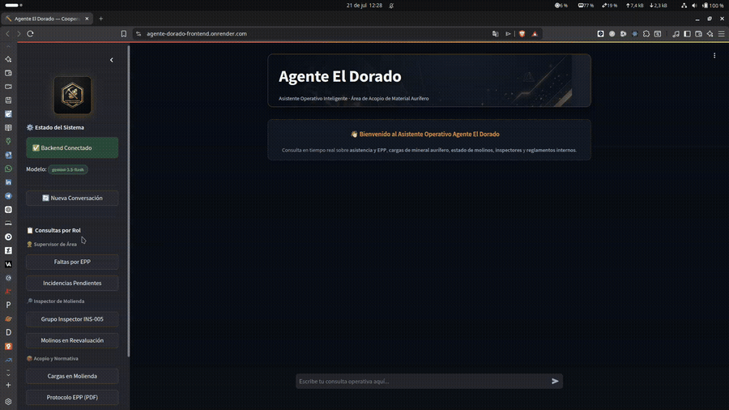

# Agente El Dorado — Cooperativa Minera El Dorado

> **Asistente Inteligente de IA para la Gestión Operativa y Normativa del Área de Acopio de Material Aurífero**

[](https://www.python.org/)
[](https://www.langchain.com/)
[](https://fastapi.tiangolo.com/)
[](https://streamlit.io/)
[](https://ai.google.dev/)
[](https://www.docker.com/)
[](https://agente-dorado-frontend.onrender.com)

---

## 🌐 Demo en Producción

| Servicio | URL |
|---|---|
| **Frontend (Chat UI)** | [https://agente-dorado-frontend.onrender.com](https://agente-dorado-frontend.onrender.com) |
| **Backend API Docs** | [https://agente-dorado-backend.onrender.com/docs](https://agente-dorado-backend.onrender.com/docs) |
| **Health Check** | [https://agente-dorado-backend.onrender.com/health](https://agente-dorado-backend.onrender.com/health) |

> ⚠️ **Nota de Infraestructura (Plan Gratuito de Render):**  
> Los servicios se encuentran alojados en la capa gratuita (*Free Tier*) de Render, la cual suspende automáticamente los contenedores tras **15 minutos de inactividad**.
>
> 💡 **Recomendaciones para la prueba:**
> - **Primera consulta o reingreso (Cold Start):** Si al ingresar ves el mensaje `⏳ Servidor iniciando (Cold Start)...` en el panel lateral, el contenedor está despertando. Aguarda de **15 a 20 segundos** sin cerrar la pestaña.
> - **Verificación sin refrescar:** Puedes hacer clic en el botón **`🔄 Ver Estado`** en la barra lateral. Una vez que el indicador cambie a `✅ Backend Conectado`, todas las consultas responderán de forma fluida e inmediata.

---

## 🎬 Demostración en Funcionamiento



> El GIF muestra consultas reales al agente desplegado en producción: asistencia y EPP, estado de molinos, grupos de inspectores y consultas de normativa vía RAG.  
> 📥 [Descargar video en alta calidad (MP4)](docs/assets/funcionamiento-agente.mp4)

---

## 📌 Origen y Contexto del Proyecto

Este proyecto fue desarrollado como entrega para el **Challenge Alura Agente** del programa **Oracle Next Education (ONE)** impulsado por **Alura Latam**.

### Base en una Experiencia Real

El problema que resuelve este agente **está inspirado en una experiencia laboral real** en una empresa del sector minero. Sin embargo, la implementación fue deliberadamente simplificada y adaptada en los siguientes aspectos:

- **Alcance reducido:** Se modeló únicamente el flujo de trabajo del área de procesado de acopio y recepción de material — una sola área operativa de la empresa original.
- **Empresa ficticia:** Se optó por usar el nombre **Cooperativa Minera El Dorado** y datos completamente ficticios (aunque lógicos y coherentes con el dominio) para resguardar la integridad e información confidencial de la empresa real.
- **Datos sintéticos:** Todos los CSVs y documentos PDF son generados para este proyecto; no contienen información real de trabajadores, cargas ni operaciones.

### El Problema
En el área de acopio de una empresa minera, supervisores, inspectores y personal administrativo necesitan consultar constantemente información dispersa en múltiples registros (asistencia, cargas, estado de molinos, incidencias) y manuales normativos (protocolos de EPP, reglamentos de rotación). Acceder a esta información de forma rápida, sin depender de reportes manuales ni conocer la estructura de los archivos, es el problema central que motiva este agente.

### La Solución: Agente El Dorado
Un agente conversacional inteligente capaz de interpretar preguntas en lenguaje natural, seleccionar de forma autónoma la herramienta correcta (**Tool-Calling**) o realizar búsquedas semánticas sobre documentos PDF (**RAG**), devolviendo respuestas precisas, estructuradas y verificables sin inventar datos.

---

## 🏗️ Arquitectura del Sistema

El proyecto implementa una **arquitectura desacoplada en 3 capas** que separa estrictamente la interfaz de usuario, la lógica del agente y las fuentes de datos:

```text
 ┌─────────────────────────────────────────────────────────────┐
 │                    CLIENTE / FRONTEND                       │
 │                    Streamlit Chat UI                        │
 │           - Gestión de Sesión (UUID por usuario)            │
 │           - Verificador de Salud en Vivo (Health Badge)     │
 └──────────────────────────────┬──────────────────────────────┘
                                │ HTTP REST (POST /preguntar)
                                ▼
 ┌─────────────────────────────────────────────────────────────┐
 │                    SERVIDOR / BACKEND                       │
 │                      FastAPI Service                        │
 │           - Middleware CORS & Rate Limiter                  │
 │           - Manejo Graceful de Errores de Cuota API         │
 └──────────────────────────────┬──────────────────────────────┘
                                │
                                ▼
 ┌─────────────────────────────────────────────────────────────┐
 │                   ORQUESTADOR DEL AGENTE                    │
 │                   LangChain 1.x Agent                       │
 │           - Chat History por Sesión (In-Memory)             │
 │           - Prompt de Dominio Minero y Reglas RAG          │
 └──────────────┬───────────────────────────────┬──────────────┘
                │ Tool-Calling                  │ Retrieval (FAISS)
                ▼                               ▼
 ┌──────────────────────────────┐ ┌──────────────────────────────┐
 │    6 TOOLS OPERATIVAS (CSV)  │ │      TOOL RAG (PDFs)         │
 │  - Asistencia & EPP          │ │  - Manual General Acopio     │
 │  - Seguimiento de Cargas     │ │  - Protocolo Seguridad/EPP   │
 │  - Incidencias Registradas   │ │  - Reglamento Rotación       │
 │  - Estado de Molinos         │ │  - Recepción de Material     │
 │  - Grupos de Inspectores     │ │  - Evaluación de Molinos     │
 └──────────────────────────────┘ └──────────────────────────────┘
```

---

## 🛠️ Tecnologías y Stack Utilizado

| Componente | Tecnología | Razón de Elección |
|---|---|---|
| **Lenguaje Core** | Python 3.11+ | Ecosistema estándar para IA y manipulación de datos. |
| **Agente / Orquestador** | LangChain 1.x | Estándar de la industria para agentes tool-calling y RAG. |
| **Modelo LLM** | Google Gemini 2.0 Flash | 1,500 peticiones/día gratuitas, baja latencia y soporte nativo de herramientas. |
| **Embeddings & VectorStore** | Google Generative AI + FAISS | Búsqueda semántica sobre PDFs sin dependencias de base de datos externa. |
| **Backend Web** | FastAPI + Uvicorn | Rendimiento asíncrono elevado, validación automática Pydantic y swagger docs. |
| **Frontend UI** | Streamlit | Interfaz interactiva de chat nativa en Python, limpia y responsiva. |
| **Contenedores** | Docker & Docker Compose | Garantiza despliegue idéntico en cualquier entorno (local o cloud). |
| **Despliegue** | Render (Free Tier) | Pipeline GitOps con Blueprint YAML, auto-deploy desde `main`. |

---

## 🎭 Roles de Usuario y Ejemplos de Consultas

> **Nota sobre los roles:** En la versión actual, el agente **no distingue entre tipos de usuario**. Cualquier persona con acceso al frontend puede realizar cualquier consulta disponible. La separación por rol (con restricción de acceso a información según perfil) es una **mejora futura planificada** — ver sección al final de este documento.

Los roles documentados a continuación representan los **perfiles operativos** del área de acopio para los que se diseñaron las herramientas y los datos del agente:

### 1. 👷 Supervisor de Área
- **Consulta**: *"¿Cuántos trabajadores faltaron la última semana por falta de EPP?"*
- **Respuesta del Agente**: *"En la última semana se registraron 4 ausencias asociadas a la falta de EPP obligatorio (casco y botas dieléctricas). Los trabajadores afectados son..."*

### 2. 🔍 Inspector de Molienda
- **Consulta**: *"¿A qué grupo pertenece el inspector INS-005 en julio de 2026 y qué molino tiene asignado?"*
- **Respuesta del Agente**: *"El inspector INS-005 pertenece al Grupo G-02 para el período 2026-07, el cual tiene asignado el Molino M-02 (Trapiche El Sol)."*

### 3. 🚚 Administrativo de Acopio
- **Consulta**: *"¿Cuántas cargas de material aurífero están actualmente en estado de molienda?"*
- **Respuesta del Agente**: *"Actualmente hay 5 cargas en proceso de molienda con un peso total estimado de 42.5 toneladas..."*

### 4. 📄 Consultas de Normativa y Protocolos (RAG)
- **Consulta**: *"¿Cuáles son los requisitos obligatorios de EPP según el protocolo de seguridad?"*
- **Respuesta del Agente**: *"Según el Protocolo de Seguridad y EPP (Pág. 4), el personal de acopio debe contar obligatoriamente con: Casco tipo II, Botas de seguridad con puntera, Lentes de protección y Chaleco reflexivo..."*

---

## ✅ Evidencia de Respuestas Verificadas

Las respuestas del agente son **trazables a fuentes de datos concretas**. A continuación se documentan consultas reales ejecutadas durante las pruebas end-to-end, con indicación de la fuente que respalda cada respuesta.

### Consulta 1 — Asistencia y EPP (Tool: `consultar_asistencia_epp`)
**Pregunta**: *"¿Cuántos trabajadores registraron ausencia por falta de EPP esta semana?"*

| Campo | Detalle |
|---|---|
| **Herramienta invocada** | `consultar_asistencia_epp(query='ausencias EPP semana')` |
| **Fuente de datos** | `backend/data/Asistencia_EPP_Julio2026.csv` |
| **Verificación** | El CSV contiene registros individuales por trabajador con columna `motivo_ausencia`. El agente filtra por `"falta EPP"` y devuelve el conteo exacto. |

### Consulta 2 — Inspector y Molino asignado (Tool: `consultar_grupos_inspectores`)
**Pregunta**: *"¿A qué grupo pertenece el inspector INS-005 en julio de 2026?"*

| Campo | Detalle |
|---|---|
| **Herramienta invocada** | `consultar_grupos_inspectores(query='INS-005 julio 2026')` |
| **Fuente de datos** | `backend/data/Grupos_Inspectores_Julio2026.csv` |
| **Verificación** | El CSV tiene columnas `inspector_id`, `grupo`, `periodo` y `molino_asignado`. La respuesta es un lookup directo sin alucinación. |

### Consulta 3 — Protocolos EPP (Tool: `buscar_en_documentos` — RAG)
**Pregunta**: *"¿Cuáles son los requisitos de EPP según el protocolo de seguridad?"*

| Campo | Detalle |
|---|---|
| **Herramienta invocada** | `buscar_en_documentos(query='requisitos EPP protocolo seguridad')` |
| **Fuente de datos** | `backend/data/Protocolo_Seguridad_Acopio.pdf` |
| **Verificación** | La búsqueda semántica FAISS recupera los fragmentos relevantes del PDF. El agente cita el documento y no añade información no presente en él. |

### Consulta 4 — Estado de Cargas (Tool: `consultar_cargas`)
**Pregunta**: *"¿Cuántas cargas están actualmente en estado 'en_molienda'?"*

| Campo | Detalle |
|---|---|
| **Herramienta invocada** | `consultar_cargas(query='cargas en molienda')` |
| **Fuente de datos** | `backend/data/Seguimiento_Cargas_Julio2026.csv` |
| **Verificación** | El CSV contiene columna `estado_carga`. El agente filtra y cuenta registros con valor `en_molienda` directamente del archivo. |

> **Nota para el evaluador:** Para una verificación independiente, puede ejecutar el script de pruebas end-to-end incluido en el repositorio (ver sección siguiente) o inspeccionar directamente los archivos CSV y PDF en `backend/data/`.

---

## 🔭 Mejoras Futuras

El proyecto es funcional en su versión actual, pero abre líneas de evolución relevantes:

### Control de Acceso por Rol
Actualmente el agente responde cualquier consulta sin distinción de quién pregunta. Una mejora natural sería implementar **autenticación con perfiles de rol**, de modo que:
- Un **supervisor** solo pueda consultar asistencia e incidencias de su área.
- Un **inspector** acceda únicamente a sus grupos y molinos asignados.
- Un **administrativo** tenga visibilidad completa de cargas pero no de datos de personal.

Esto implicaría agregar un middleware de autenticación en el backend (JWT o sesiones) y condicionar las herramientas disponibles en el prompt del agente según el rol autenticado.

### Expansión a Más Áreas de la Empresa
El flujo actual cubre solo el área de acopio y recepción. La arquitectura está diseñada para escalar: agregar nuevas herramientas (`tools.py`) y fuentes de datos (`data/`) para otras áreas (laboratorio, administración, logística) sin modificar el núcleo del agente.

### Persistencia de Historial de Conversaciones
La memoria del agente es in-memory por sesión. Una versión producción-ready persistiría el historial en una base de datos (PostgreSQL + pgvector) para análisis de uso, auditoría y continuidad entre sesiones.

---

## 💡 Aprendizajes y Reflexiones

Este proyecto fue una oportunidad para consolidar varios aprendizajes que van más allá del challenge en sí:

### Los Agentes como Complemento a Dashboards Clásicos
Un dashboard tradicional es excelente para monitoreo y visualización de métricas conocidas. Un agente conversacional es ideal para **consultas ad hoc, no previstas y en lenguaje natural** — preguntas que nadie anticipó al diseñar el dashboard. Lejos de reemplazarse, ambos se complementan: el dashboard para el operador que sabe qué quiere ver, el agente para el que necesita explorar o formular preguntas complejas en tiempo real.

### Agente con LangChain vs Agente con n8n
Durante el programa ONE también se exploró la construcción de agentes con **n8n** (plataforma de automatización visual). La comparación es reveladora:

| Dimensión | n8n (visual/low-code) | LangChain (código) |
|---|---|---|
| **Curva de entrada** | Baja — flujos visuales intuitivos | Media — requiere conocer Python y el ecosistema |
| **Flexibilidad** | Limitada a nodos disponibles | Total — cualquier lógica es posible |
| **Integración de datos propios** | Requiere conectores externos | FAISS, CSV, PDF directamente en código |
| **Control del prompt** | Parcial | Completo |
| **Escalabilidad a producción** | Depende de la instancia n8n | Dockerizable, desplegable en cualquier cloud |
| **Mantenibilidad** | Flujos complejos difíciles de versionar | Git nativo, testeable, auditable |

La conclusión práctica: **n8n es ideal para prototipos rápidos y automatizaciones simples**; LangChain con Python es la elección correcta cuando se necesita control total sobre el comportamiento del agente, integración con fuentes de datos propias y una arquitectura mantenible a largo plazo.

## 📁 Estructura del Repositorio

```text
.
├── backend/
│   ├── app/
│   │   ├── agent.py          # Lógica del agente LangChain y memoria de chat
│   │   ├── gemini_config.py  # Gestión de modelos Gemini, fallbacks y cuotas
│   │   ├── main.py           # Endpoints FastAPI (/preguntar, /health)
│   │   ├── rate_limit.py     # Limitador de peticiones por minuto/día
│   │   ├── schemas.py        # Modelos Pydantic de entrada y salida
│   │   ├── tools.py          # 6 herramientas especializadas de consulta
│   │   └── vectorstore.py    # Carga y generación del índice semántico FAISS
│   ├── data/                 # Fuentes de datos CSV y PDFs institucionales
│   ├── Dockerfile            # Imagen contenedor Backend
│   ├── requirements.txt      # Dependencias backend con versiones fijadas
│   └── test_local.py         # Script de pruebas end-to-end automáticas
├── frontend/
│   ├── assets/               # Logo y banner de la interfaz
│   ├── Dockerfile            # Imagen contenedor Frontend
│   ├── requirements.txt      # Dependencias frontend
│   └── streamlit_app.py      # Interfaz de usuario interactiva
├── docs/
│   └── assets/               # GIFs, capturas y recursos visuales del README
├── docker-compose.yml        # Orquestación multicontenedor local
├── render.yaml               # Blueprint de despliegue en Render
└── README.md                 # Documentación principal
```

---

## 🚀 Guía de Instalación y Ejecución

### Requisitos Previos
- [Docker Desktop](https://www.docker.com/) instalado.
- API Key de Google Gemini ([Obtener gratis en Google AI Studio](https://aistudio.google.com/app/apikey)).

### Despliegue Rápido con Docker Compose (Recomendado)

1. **Clonar el repositorio**:
   ```bash
   git clone https://github.com/edisson-f-ch-s/Agente-Cooperativa-Minera-El-Dorado.git
   cd Agente-Cooperativa-Minera-El-Dorado
   ```

2. **Configurar las variables de entorno**:
   Crea un archivo `.env` en la raíz del proyecto:
   ```env
   GOOGLE_API_KEY=tu_clave_api_gemini_aqui
   GEMINI_MODEL=gemini-2.0-flash
   ```

3. **Iniciar la aplicación**:
   ```bash
   docker-compose up -d --build
   ```

4. **Acceder a los servicios**:
   - 🌐 **Frontend (Chat UI)**: [http://localhost:8501](http://localhost:8501)
   - ⚡ **Backend API Docs**: [http://localhost:8000/docs](http://localhost:8000/docs)
   - 🩺 **Salud del Backend**: [http://localhost:8000/health](http://localhost:8000/health)

---

## 🧪 Pruebas Automáticas End-to-End

El proyecto incluye un script de prueba automatizado que evalúa las consultas contra el agente sin necesidad de iniciar la interfaz web:

```bash
# Configurar la API key
export GOOGLE_API_KEY="tu_clave_aqui"

# Ejecutar prueba rápida (2 consultas representativas)
backend/venv/bin/python backend/test_local.py --quick

# Ejecutar suite completa
backend/venv/bin/python backend/test_local.py
```

---

## 🚢 Lecciones de Despliegue en Render

El despliegue en producción presentó desafíos no documentados en la guía oficial de Render. Se registran aquí para facilitar la reproducción o el onboarding de nuevos colaboradores.

### ❌ Error 1 — `render.yaml` con propiedad inválida en `fromService`

**Síntoma:**
```
services[1].envVars[0].fromService.property
invalid service property: url. Valid properties are connectionString, host, hostport, port.
```

**Causa:** La sintaxis de Render para referenciar propiedades de otro servicio no soporta `url` como propiedad. Se intentó inyectar automáticamente la URL del backend al frontend mediante `fromService`.

**Solución:** Declarar `BACKEND_URL` como variable manual (`sync: false`) y configurarla desde el dashboard de Render una vez que el backend está desplegado y su URL pública es conocida.

```yaml
# render.yaml — forma correcta
- key: BACKEND_URL
  sync: false  # El operador la configura manualmente en el dashboard
```

---

### ❌ Error 2 — Frontend no conecta al backend (`Backend fuera de línea`)

**Síntoma:** El frontend mostraba `❌ Backend fuera de línea` con endpoint `http://agente-dorado-backend:8000`.

**Causa:** Se asumió erróneamente que Render comparte una red Docker interna entre servicios (como Docker Compose). En Render, **cada servicio es completamente aislado** y solo se comunica mediante sus URLs públicas HTTPS.

**Solución:** Configurar `BACKEND_URL` con la URL pública del backend:
```
BACKEND_URL = https://agente-dorado-backend.onrender.com
```

> **Regla clave:** En Render, nunca usar `http://nombre-servicio:puerto`. Siempre usar la URL HTTPS pública asignada por Render al servicio.

---

### ⚠️ Cold Start en Free Tier y Gestión Resiliente

El plan gratuito de Render suspende los servicios tras ~15 minutos de inactividad. La primera consulta tras un periodo de reposo puede tardar **15-25 segundos** en responder mientras la máquina virtual e imagen Docker reinician.

**Estrategia de recuperación transparente implementada:**
1. El frontend detecta respuestas intermedias `502/503` o tiempos de respuesta elevados durante la suspensión y muestra el estado `⏳ Servidor iniciando (Cold Start)...`.
2. Las consultas POST del chat cuentan con un tiempo de espera extendido (`timeout=90s`), permitiendo que el usuario envíe una pregunta aunque el backend esté dormido; la petición esperará al arranque del contenedor y devolverá la respuesta sin interrumpir la sesión.
3. El usuario puede pulsar el botón **`🔄 Ver Estado`** en la barra lateral para verificar la conexión en cualquier momento sin necesidad de recargar la página completa.

---

### ⚠️ Cuota de API de Google Gemini (Free Tier)

Durante pruebas intensivas se agotó la cuota de peticiones por minuto (`RPM`) del plan gratuito de Google AI Studio.

**Síntoma:** `429 RESOURCE_EXHAUSTED — You have exhausted your quota`

**Solución implementada:** El backend tiene un sistema de fallback automático entre modelos Gemini. Si el modelo principal falla por cuota, intenta en orden:

```python
FALLBACK_GEMINI_MODELS = (
    "gemini-2.0-flash",
    "gemini-2.0-flash-lite",
    "gemini-3.5-flash",
    "gemini-3.5-flash-lite",
)
```

El modelo activo en cada momento es visible en el panel lateral del frontend (badge "Modelo:").

---

## 📜 Licencia y Créditos

- **Programa**: Oracle Next Education (ONE) / Alura Latam
- **Challenge**: Challenge Alura Agente
- **Licencia**: [MIT License](LICENSE)
